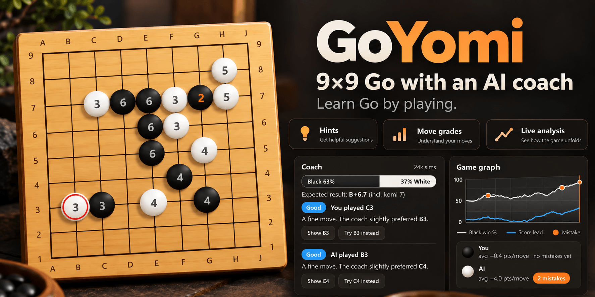

# GoYomi · 9×9

Learn Go by playing. 9×9 games against an AI that scales from almost random
to genuinely strong, with a coach that grades every move, explains what
happened, and shows you what it would have played.

## ▶ [Play GoYomi in your browser](https://killedbyapixel.github.io/GoYomi/)

## What you get

- **An opponent at your level.** Eight AI levels from Pebble to Dragon, plus
  handicap stones and komi. After a lopsided game it suggests a better match.
  Play Black, White, or both sides in study mode.
- **A coach that watches every move.** Win bar, expected score, and a grade
  for each move with a plain-language reason. **Show** puts the coach's move
  on the board; **Try it instead** plays it for you.
- **Hints when you want them.** Ask for the best moves, or press **Their
  idea** to see what your opponent is planning and what ignoring it costs.
- **See the board like a stronger player.** Overlays for liberties, atari
  alerts, territory, move preview and move numbers.
- **Take back freely.** Undo any move, try something else, and switch between
  the variations you've created.
- **Scoring made simple.** Pass twice and the coach counts the game, marking
  dead stones. Click a group if you disagree.
- **Review your games.** A game graph with mistakes marked. Click to jump to
  any move. Save and load SGF files. Your current game is saved automatically.

Keyboard shortcuts and a one-minute guide to the rules are in the game
itself.

© 2026 Frank Force. Free and open source under the [GPL-3.0 license](LICENSE).
