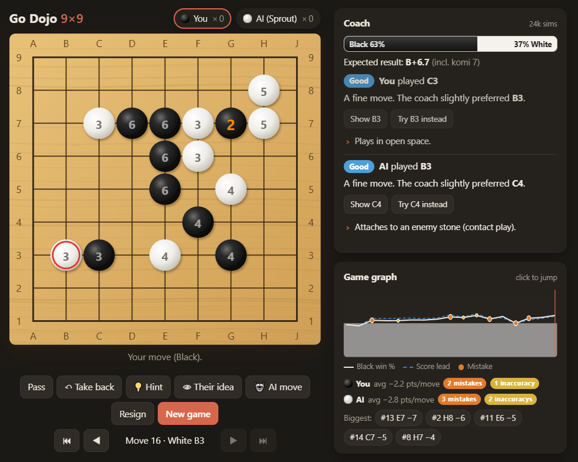

# GoYomi · 9×9

A friendly place to learn Go. Play 9×9 games against an AI that scales from
"almost random" to genuinely strong, while a coach watches every move,
grades it, explains what happened, and shows you what it would have played.

## ▶ [Play GoYomi in your browser](https://killedbyapixel.github.io/GoYomi/)

## Play at your level

Pick your colour and an opponent when you start a game. Black plays first; if
you would rather see how the AI opens, take White. **Both (study)** lets you
play both sides and use the coach as a sparring partner.

| Level | What to expect |
|---|---|
| 1 · Pebble | Plays almost at random. Practise capturing. |
| 2 · Seedling | Grabs captures, wanders a lot. |
| 3 · Sprout | Knows simple shapes, still misses plenty. |
| 4 · Reed | Fights back, but leaves weaknesses. |
| 5 · Stream | Casual player. Makes real mistakes. |
| 6 · River | Solid fighting on a small board. |
| 7 · Mountain | Strong. Punishes overplays. |
| 8 · Dragon | Full strength. Thinks for several seconds. |

If the AI keeps winning easily, give yourself **handicap stones** (2 to 5) or
adjust the **komi**. After a lopsided game the results screen suggests a level
that should be a better match.

## The coach

The coach is a second engine that reads every position in the background,
whichever side is to move.

- **Win bar and expected result.** Who is ahead, by how much, and how the game
  is trending.
- **A grade for every move**, yours and the AI's: Best, Good, Inaccuracy,
  Mistake or Blunder, with the number of points it cost. Each grade comes with
  a plain-language reason: captures, atari, double atari, ladders, saving or
  connecting stones, cutting, self-atari, filling your own eye, big swings in
  territory.
- **Show** puts the coach's preferred move on the board with the continuation
  it expects, as numbered stones. **Try it instead** plays the coach's move
  for you as a new variation, so you can see where it leads and compare.
- **Hint** (`H`) shows the coach's favourite moves for the current position
  with their win chances. **Best moves** in *Show on board* keeps them visible
  all the time.
- **Their idea** (`O`) shows what the opponent wants to play next if you play
  elsewhere, how they expect it to continue, and what ignoring it would cost.
- **Live warnings** for any group in atari, yours or theirs, including "can't
  escape, it's a ladder" when running away won't help.
- **Game graph** of win percentage and score lead, with mistakes marked. Click
  anywhere on it to jump to that move. Below it, a summary counts each
  player's mistakes and links to the biggest ones.

Coach depth (Quick, Normal, Deep) is in Settings. Deeper is more accurate but
slower.

## See the board like a stronger player

Turn overlays on and off in *Show on board*, or with the keys in brackets.

- **Liberties** (`L`): the number of liberties on every group. 1 means atari.
- **Atari alerts** (`A`): red rings on groups in atari, and a target on the
  point that captures or saves them.
- **Territory** (`T`): who the coach expects to own each point. Stones it
  thinks are dead get a small square.
- **Move preview** (`V`): hover a point before you play. ✕ marks stones you
  would capture, orange rings show new ataris, the number is your stone's
  liberty count, and illegal points tell you why (ko, suicide, repetition).
- **Grade moves** (`G`): the coach's grade and explanation after each move.
- **Best moves** (`B`): the coach's top choices with win percentage and point
  lead, always on.
- **Move numbers** (`N`): the order the stones were played in.

## Take back, explore, compare

**Take back** (`U`) undoes your last move and the AI's reply. Nothing is
lost: if you then play a different move, the game becomes a tree and both
lines are kept. Variation buttons appear under the board so you can switch
between them, and the arrow keys step through the game one move at a time.
Step back into the middle of a game and play from there to explore an idea,
then jump back to the latest move with `End`.

**AI move** asks the AI to play for whichever side is to move, which is handy
in study mode or when you want to see how it would handle your position.

## Finishing a game

Pass twice in a row and the coach counts the game. It marks the stones it
believes are dead and shows who owns each point. Disagree? Click a group to
flip it between dead and alive, and the score updates. If the game is not
really over, **Resume play** picks up where you left off.

Scores use area counting (Chinese rules): your stones plus the empty points
you surround. The panel also shows what the result would be under Japanese
territory counting, so you can see both conventions side by side.

You can also **Resign**, and once the game is over the same button becomes
**Count** so you can bring the counting panel back at any time.

## Learn as you go

The *Learn* panel on the right has the rules in one minute, a short guide to
life and death, and tips for 9×9. Sound effects for stones and captures can
be switched on in Settings.

## Keep your games

Your current game is saved automatically in the browser, so you can close the
tab and come back later. The coach re-reads the game when you return, so the
grades and graph take a moment to fill back in. **Save SGF** downloads the game, including all your
variations, in the standard SGF format that any Go program can open, and
**Load SGF** brings a game back in for review with the coach.

## Keyboard shortcuts

| Key | Action |
|---|---|
| `←` / `→` | Step back / forward through the game |
| `Home` / `End` | Jump to the start / latest move |
| `U` or `Backspace` | Take back |
| `H` | Hint |
| `O` | Their idea |
| `P` | Pass |
| `Esc` | Clear hint and suggestion markers |
| `L` `A` `T` `V` `G` `B` `N` | Toggle liberties, atari alerts, territory, move preview, grades, best moves, move numbers |

## Running it yourself

The easiest way to play is the link at the top. To run a copy locally on
Windows, double-click `start-go.bat` and a tab opens ready to play. Otherwise
run `npm start` in the project folder (it needs [Node.js](https://nodejs.org))
and open the address it prints.

© 2026 Frank Force. GoYomi is free and open source under the [GPL-3.0 license](LICENSE).
