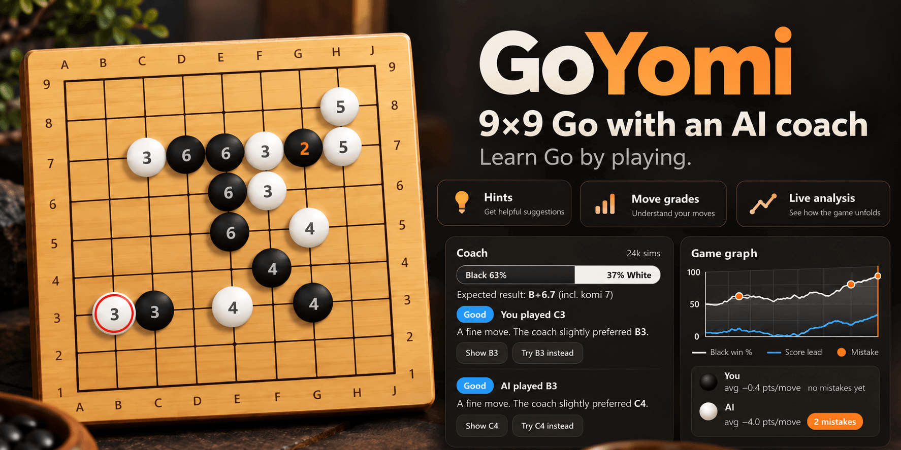

# GoYomi · 9×9

Learn Go by playing. 9×9 games against an AI that scales from almost random
to genuinely strong, with a coach that grades every move, explains what
happened, and shows you what it would have played.

## ▶ [Play GoYomi in your browser](https://killedbyapixel.github.io/GoYomi/)

## What you get

- **An opponent at your level.** Nine AI levels from Pebble to Phoenix, plus
  handicap stones and komi. After a lopsided game it suggests a better match.
  Play Black, White, or both sides in study mode.
- **A coach that watches every move.** Win bar, expected score, and a grade
  for each move with a plain-language reason. It runs KataGo's neural
  network right in your browser. Set **Coach explains for** to
  match your experience: beginners hear about liberties and captures,
  stronger players about points, threats and plans. **Show** puts the
  coach's move on the board; **Try it instead** plays it for you.
- **Play by keyboard or by ear.** Tab to the board and play with the arrow
  keys and Enter. Screen readers hear every move and the coach's comments,
  or turn on **Speak announcements** to have them read aloud. Hover any
  point the coach mentions to see where it is on the board.
- **Hints when you want them.** Ask for the best moves, or press **Their
  idea** to see what your opponent is planning and what ignoring it costs.
- **See the board like a stronger player.** Overlays for liberties, atari
  alerts, territory, move preview and move numbers.
- **Take back freely.** Undo any move, try something else, and switch between
  the variations you've created.
- **Scoring made simple.** Pass twice and the coach counts the game, marking
  dead stones. Click a group if you disagree.
- **Review your games.** A game graph with mistakes marked. Click to jump to
  any move. Save and load SGF files. Your current game is saved automatically.

Keyboard shortcuts and a one-minute guide to the rules are in the game
itself.

## How strong is it?

The top level, Dragon, played 40 games against GNU Go 3.8 at its strongest
setting and won 38 of them. GNU Go plays at about 5 to 7 kyu on 9×9, so
Dragon is a strong intermediate opponent. The lower levels step down from
there to Pebble, which is for learning how captures work; each level won its
10-game match against the one below it. Above Dragon, Phoenix plays with
KataGo's neural network and won all 12 of its games against Dragon.

© 2026 Frank Force. Free and open source under the [GPL-3.0 license](LICENSE).
The coach and Phoenix use a [KataGo](https://github.com/lightvector/KataGo)
network ([license](nets/LICENSE.txt)) run with TensorFlow.js, ported with
help from [Web KaTrain](https://github.com/Sir-Teo/web-katrain) (MIT).
